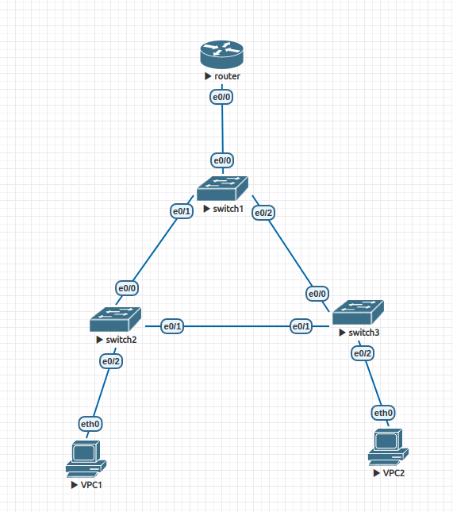
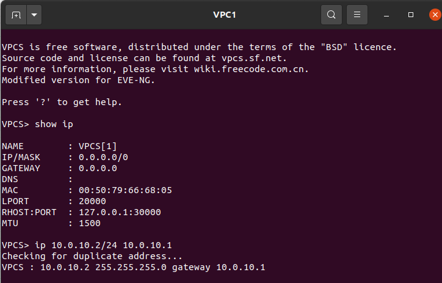
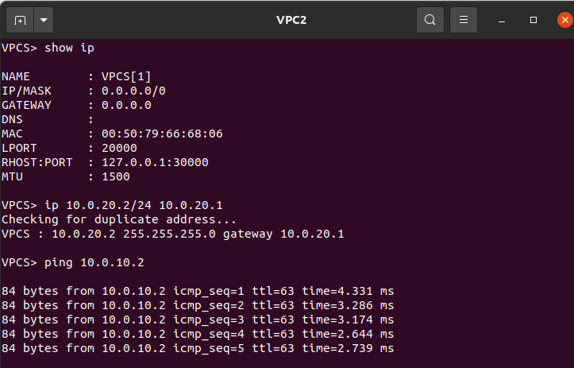
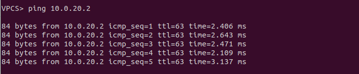
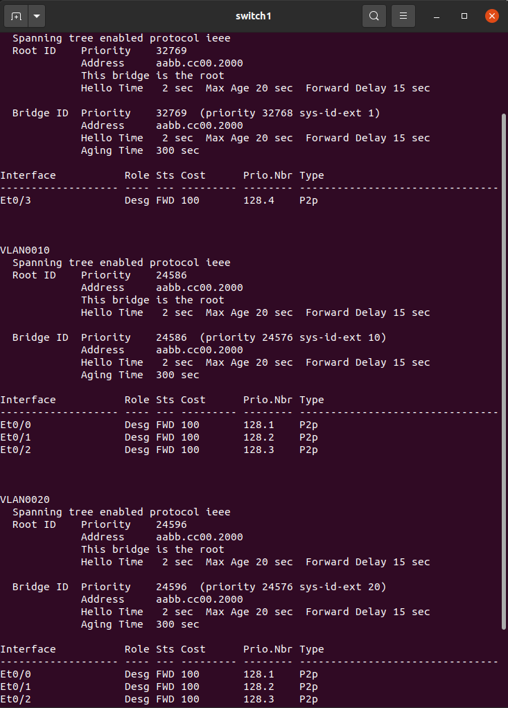
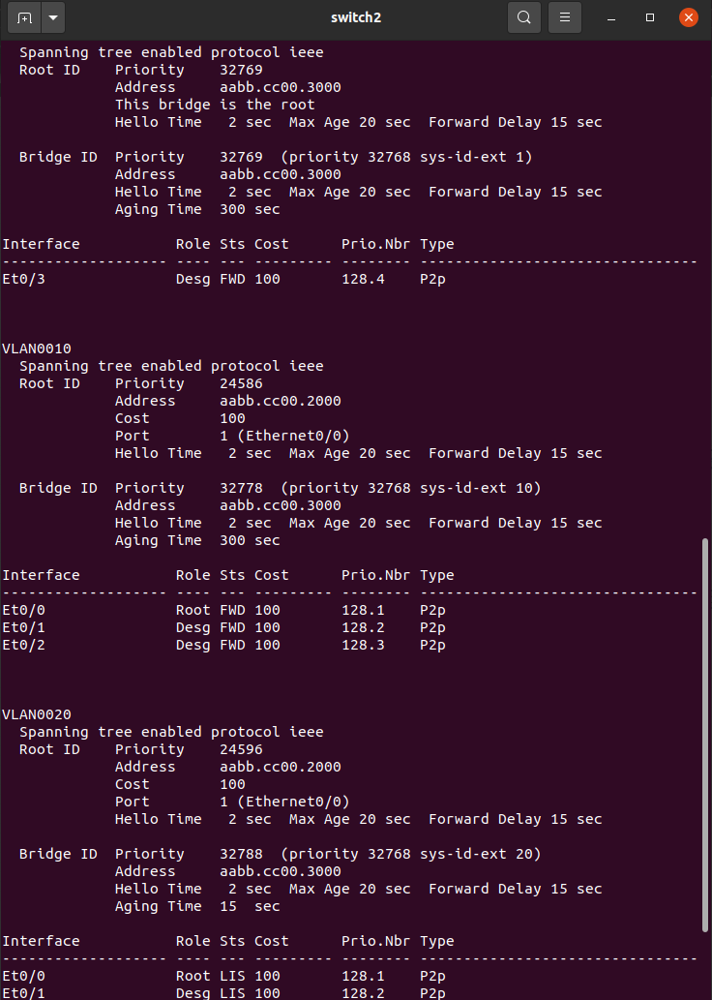
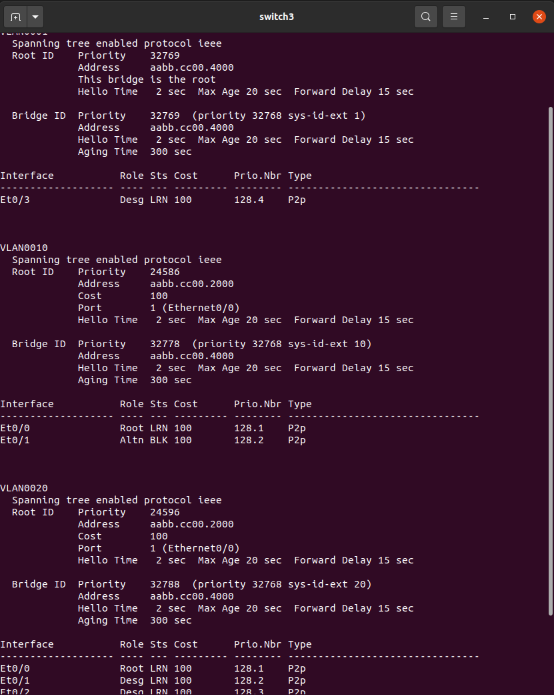

Линк между свитчами уровня доступ заблокирован протоколом stp т.к. поставил root на свитч уровня распределения. Можно убедиться, мониторя порты во время отправки пинга. Выключил vtp от cisco на свитчах.

## spanning-tree

