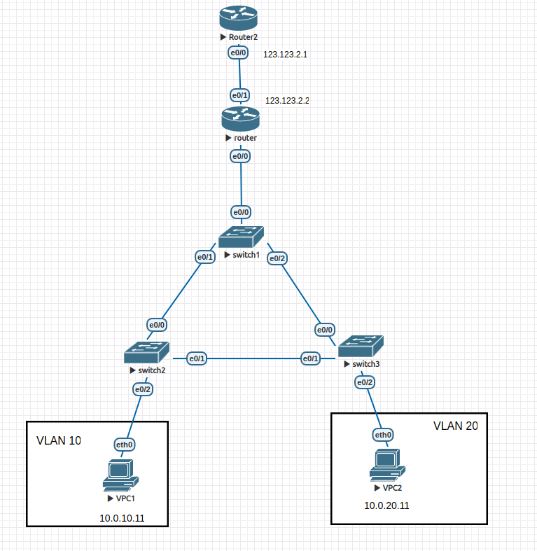
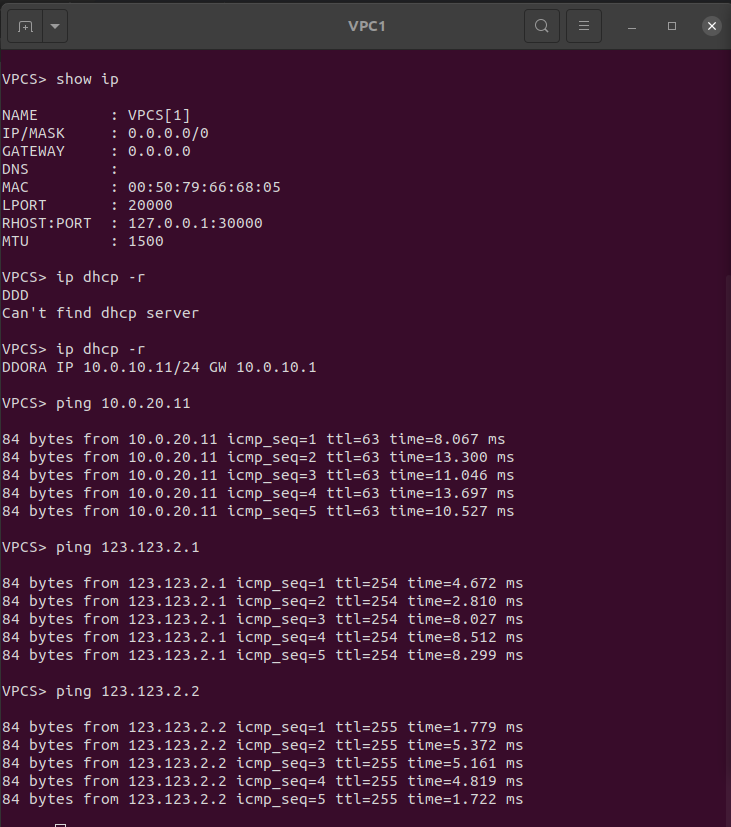
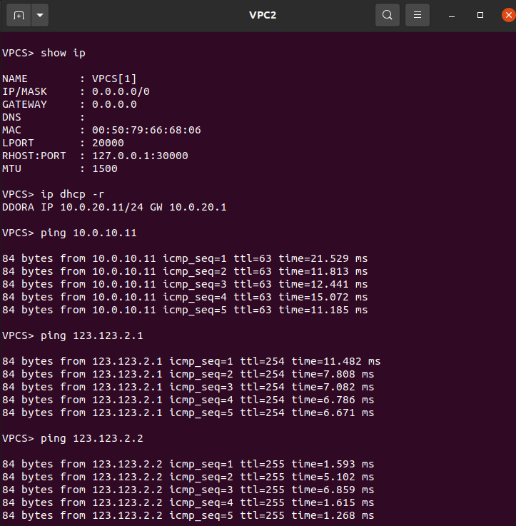

Свитчи с первого дз не трогал, поэтому spanning-tree можно посмотреть с первого дз.

Поставил dhcp на роутер с прошлого дз. Запретил выдавать ip от 1 до 10 и для vlan 10, и для vlan 20. Можно увидеть на скринах ниже, что выдаются первые дозволенные ip т.е. 11 на конце. Добавив еще клиенты можно убедиться, то для них также будут выданы корректные ip, отличные от других клиентов. В качестве DNS взял 8.8.8.8 

На скринах ниже так же видно, что ничего не сломалось из прошлого дз и клиенты могут пинговать друг другу. Ну и пинговать свой старый роутер по его ip из e0/1.

Также показал, что клиенты могут пинговать верхний роутер. Если посмотреть на e0/0 верхнего роутера, то видно что ему приходят пинги по ip нижнего роутера, которому выдал ip на e0/1 123.123.2.2. В интерфейсе e0/0 прописано, что он будет отвечать на пинги только с ip нижнего роутера т.е. 123.123.2.2. Так что, если удалить NAT, то верхнему роутеру будут приходить пинги от клиентов, либо 10.0.10.11, либо 10.0.20.11, но отвечать он на них не будет.

