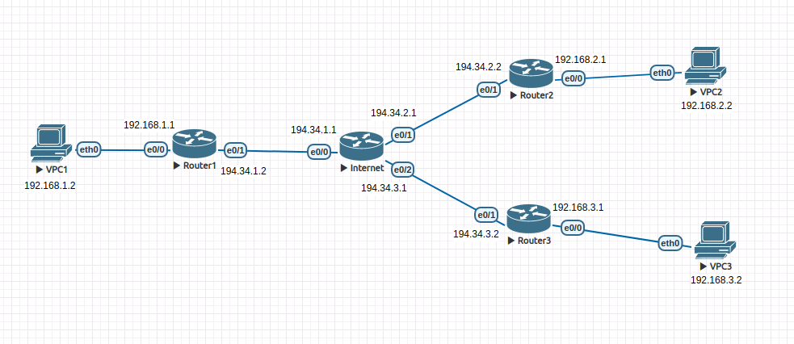
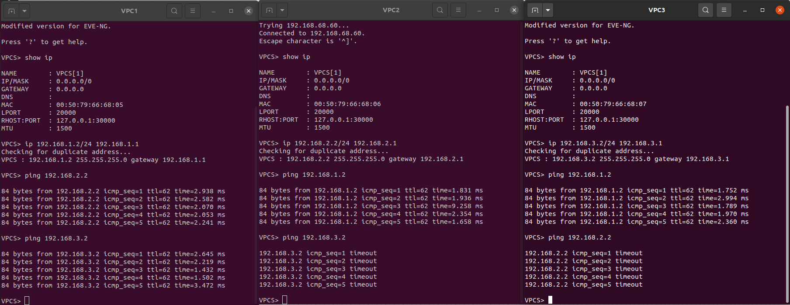

Построил VPN тоннели между клиентам по условию задачи т.е. между Client1 и Client2 проходит GRE тоннель без шифрования, а между Client1 и Client2 проходит GRE тоннель поверх IPSEC с шифрованием md5.

Ниже скрины того, что эти клиенты могут друг друга пинговать, а Client2 и Client3 не могут друг друга пинговать т.к. им туннелей не настраивал.

